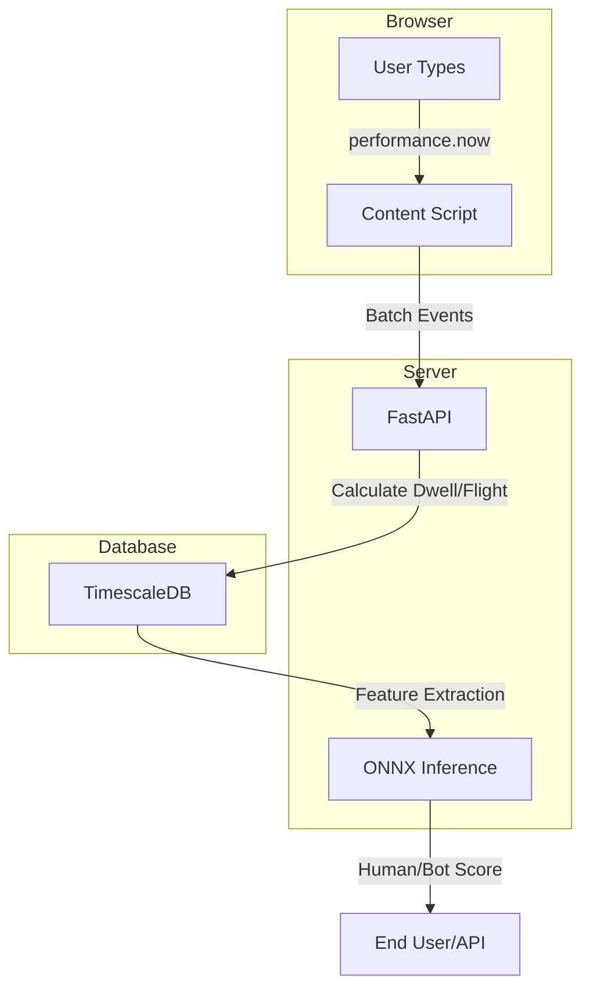

# HumanSign Implementation Walkthrough

## Summary
Built a complete **keystroke dynamics verification system** with:
* **Browser Extension** (TypeScript + Vite) for keystroke capture
* **Backend API** (FastAPI) for data processing and inference
* **ML Pipeline** (XGBoost → ONNX) for human vs bot classification
* **Database** (PostgreSQL + TimescaleDB) for time-series storage

---

## Project Structure
```text
humanSign/
├── client/                # Browser Extension
│   ├── src/
│   │   ├── content/       # Keystroke capture (performance.now())
│   │   ├── background/    # API communication
│   │   ├── types/         # TypeScript definitions
│   │   └── utils/         # Timing utilities
│   ├── manifest.json      # Chrome Extension manifest v3
│   └── vite.config.ts     # Build config
│
├── server/                # FastAPI Backend
│   └── app/
│       ├── api/routes/    # keystrokes, sessions, verification
│       ├── models/        # Pydantic schemas
│       ├── services/      # keystroke, feature, ML inference
│       ├── db/            # asyncpg + queries
│       ├── main.py        # Entry point
│       └── config.py      # Settings
│
├── ml/                    # Training Pipeline
│   └── src/
│       ├── preprocessing.py
│       ├── feature_engineering.py
│       ├── train_xgboost.py
│       └── export_onnx.py
│
├── db/schema.sql          # TimescaleDB schema
└── docker-compose.yml     # Full stack
```

---

## Key Components

### 1. Browser Extension
| File | Purpose |
|------|---------|
| `keystroke-tracker.ts` | Core tracking with performance.now() |
| `api-client.ts` | Backend communication |

**Features:**
- Sub-millisecond timing precision
- Event buffering (100 per batch)
- Auto-tracking on text input focus

---

### 2. FastAPI Backend

| Route | Method | Purpose |
|-------|--------|---------|
| `/api/v1/keystrokes/batch` | POST | Ingest keystroke events |
| `/api/v1/sessions/start` | POST | Start typing session |
| `/api/v1/sessions/{id}/end` | POST | End session |
| `/api/v1/verify` | POST | ML verification |

**Services:**
- `keystroke_service.py` - Dwell/flight time calculation
- `feature_extractor.py` - 36 ML features
- `ml_inference.py` - ONNX Runtime

---

### 3. ML Pipeline

| Script | Purpose |
|--------|---------|
| `train_xgboost.py` | Train binary classifier |
| `export_onnx.py` | Convert to ONNX |

**36 Features:**
- 16 basic stats (dwell/flight time statistics)
- 20 digraph latencies (common letter pairs)

---

### 4. Database Schema
`schema.sql` - TimescaleDB hypertable with:
- `keystrokes` - High-frequency time-series data
- `sessions` - Writing session tracking
- `session_features` - Aggregated ML features

---

## Setup Instructions

### 1. Start Database
```bash
docker compose up -d postgres
```

### 2. Install Backend
```bash
cd server
python -m venv venv
source venv/bin/activate
pip install -r requirements.txt
uvicorn app.main:app --reload
```

### 3. Build Extension
```bash
cd client
npm install
npm run build
# Load dist/ as unpacked extension in Chrome
```

### 4. Train Model
```bash
cd ml
pip install -r requirements.txt
cd src
python train_xgboost.py
python export_onnx.py
```

---

## Data Flow


**Note:** The flow includes `POST /keystrokes` for ingestion and `POST /verify` for the inference step.

---

## Next Steps

1. Download datasets from the spreadsheet (DS-01 Aalto, DS-12 Liveness Detection)
2. Train model on real data:
```bash
   python train_xgboost.py --data-dir ../data
```
3. Export ONNX:
```bash
   python export_onnx.py --benchmark
```
4. Test extension in Chrome with local backend running